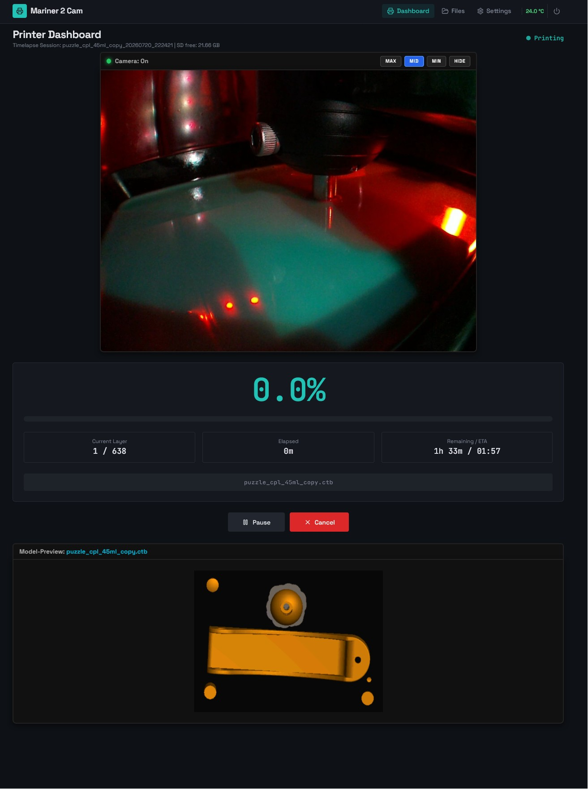
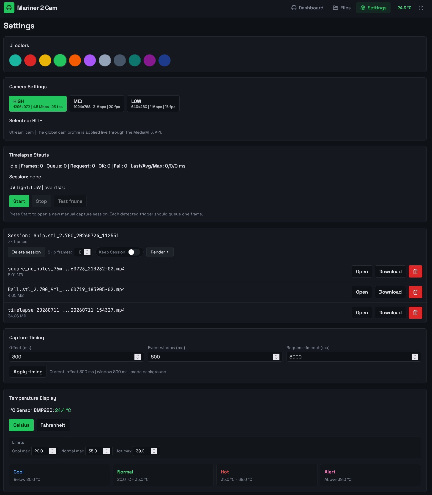
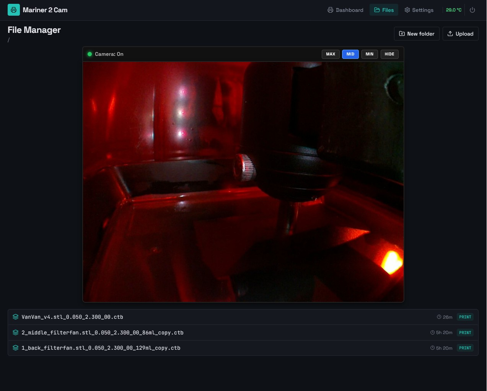
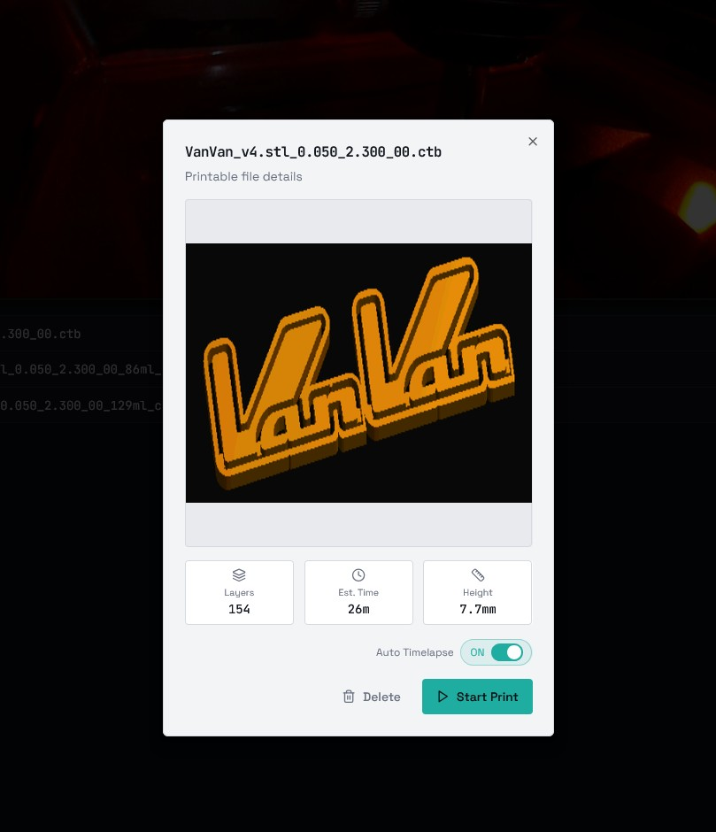
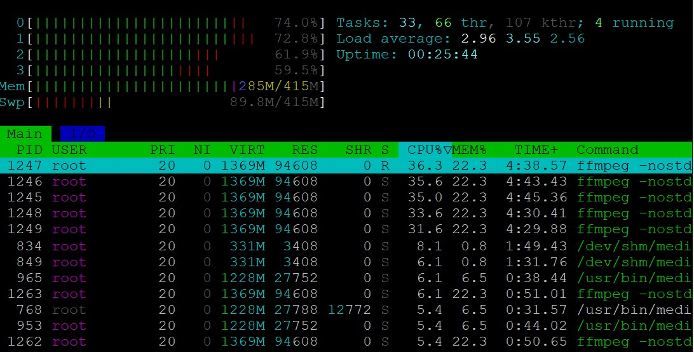
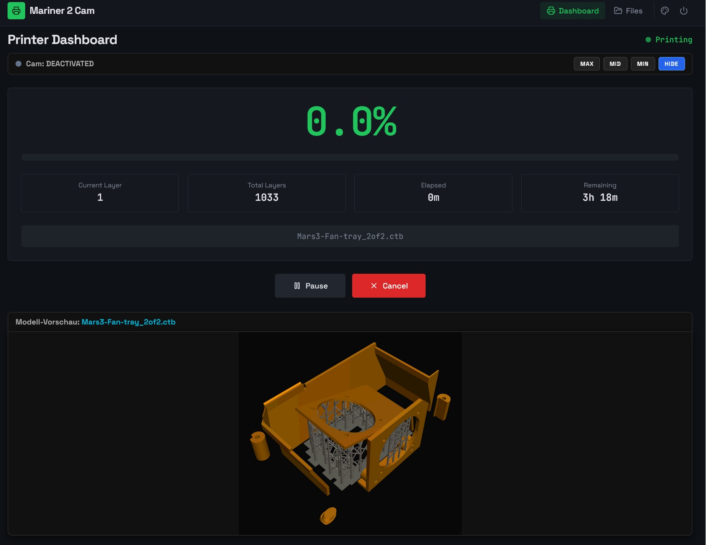
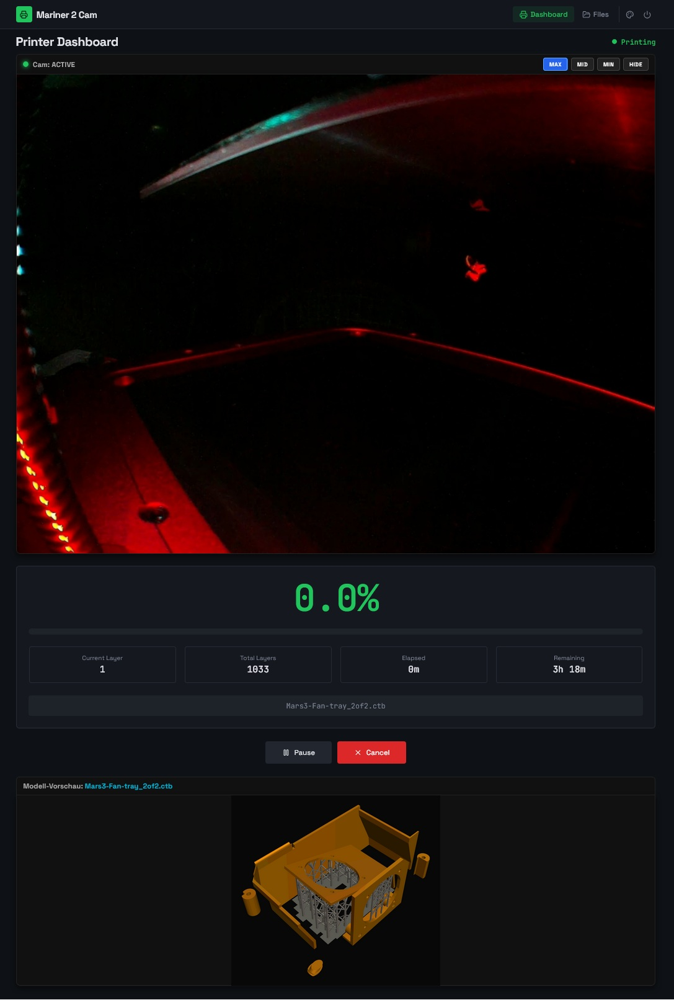
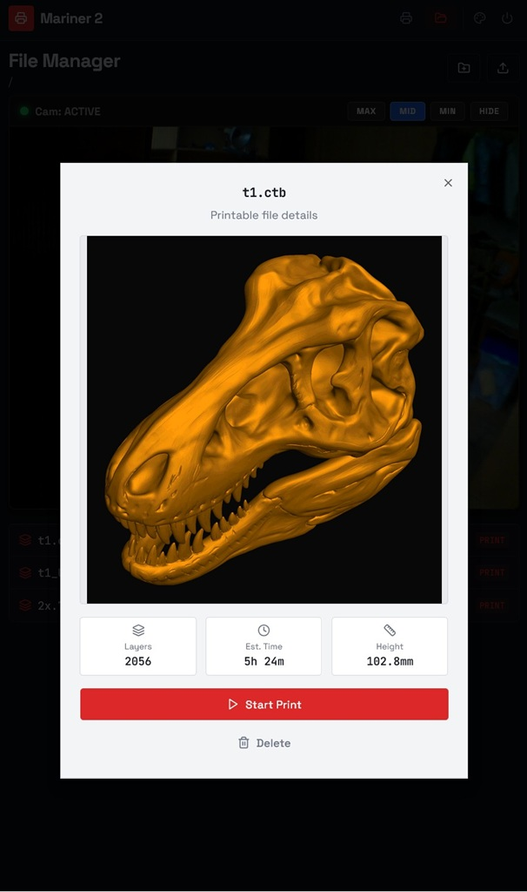

🔴 **This is an advanced version with the timelapse video function. It can make cool videos of your prints.**            -         22.july,26 - 21:40 & Copilot-AI

It is now workig fine although i will test it more.
Use an external 5V 1.5A or stronger power supply for the PI and apply an active cooling fan because when the pi is streaming and capturing in high quality the 4 cpu cores are running at loads which could be enought to trigger thermal throtteling if you dont care. I have also added visual feedback and confirmations on file actions and cancelling a print or rendering files 
A Temperatur Sensor and more UI Colors added too. 
If the Pi is offlie while website is runnig show an offline symbol.

-

-

-

-

-
CPU is rather busy but still in good range

-

Here is a short demo video. It was only a small test-object and too short to see it, but a good test result for me.
[Demo-Video ](docs/test_video_Ball_2026-07-19--18-39.mp4)
-

➡️ **[Click here to see details on the timelapse methods](docs/TIMELAPSE_MEDIAMTX_SETUP.md)**

Notes:
My initial attempt to trigger the Z.top was a fail but would have made better view for the videos but its almost impossinle because impulses don't come exactly the same time and it will make jittery videos. A detection with two ir-sensors and even 10 markings on the z-spindle is not exact enough, you would have to add a printer top delay which i don't want to.

Better is to trigger when the uv-light in the bottom is detected instead. Use the signal from the mainboard and make it a 3,3V signal into gpio24. I built a PC817 optocoupler 24V to 3.3V boaed and took the LED-Fan output of my mainboard and tweaked the fan settings with the .txt file for my Mars3 (which has mixed up lables on the mainboard!! on mine, the MB and LED Fan 24V connectors which are not populated but i use both for fan and now light uv-trigger. 
Frames which are taken when light is on have much more time to store the picture is accurate. 
The next change i made was to make the grabber start and stop for every trigger, now it runs permanently when a timelapse session is open. 

The old current layer bug was was still present like in the source of mariner2 but SHOULD be fixed now in my last change - looks good so far :)
Loading (decryption) of an original chitubox .ctb slice file was broken too for the last months in mariner2, it crashed on loading on all my ctb files. This problem was solved quick and drirt by just skipping the crc error so i never had a problem again.

Another problem was that it took very very long to show preview pictures on an original chitubox file in comparison to uv-tools modified files. This problems have vanished. I assume that it was the last chitobox update two weeks ago! Now original chitubox files, even e.g.2000+ layers @0.035mm load just fine and the preview pictures are shown in 1-2 seconds, not 1-2 min anymore. phew!

_____________________________________________________________________________________________________________________________________________________________________________________________________________________________

**from here on it isn't false, but outdated since there was no timelapse feature present at that time:**
🔴 Mariner 2 Cam for Pi Zero 2

### 3D-Printer Monitoring Tool with Camera Support, WLAN OTG-USB-Gadget, Firewall, VPN, Fail2ban, Webmin and a physical shutdown  ###
**Status:** Work-in-progress, but working stable and fine now. I went through all the steps in my guide again from a fresh install to test it.

You will need a external power adapter for you Pi for sure and be careful that you not run into the double-power problem of your pi+printer.

>**Chitobox-Note:** The ctb decryption from amd989 had to be modified a bit to work on new `.ctb` files (is it a bug or caused by a Chitobox update?).

---

 **GitHub-Project:**
 
  🔴 [https://github.com/frittna/mariner2cam]  * **Last Changes:** 17:53 - 03.June.2026
  
  Is a fork from the great Mariner 2 (amd989)    - [https://github.com/amd989/mariner]
  
  Which was a fork from Mariner (luizribeiro)    - [https://github.com/luizribeiro/mariner]

---

### 📖 Complete Installation Guide & Code

A tested full step-by-step guide to make a fresh Zero 2 W installation can be found here.
You can run it yourself by following this tutorial in 1-2 hours (in German at the moment).

➡️ **[Click here to view: CompleteInstructionZero2.txt](CompleteInstructionZero2.txt)**

---

* **Note for Pi Zero 1.1:** There is a separate instruction for the Zero 1.1 which was *NOT COMPATIBLE* at the beginning with today's automatic scripts. But the Zero 1 is weak and I sold it, so it will not have the same state of progress. If you want to run it on the Zero 1, see the file: `"Anleitung - Mariner2 - PI Zero W 1.1+2 outdated (ARM6).txt"`.

---

### Screenshots

![grafic3]docs/(Screenshot3min_FM.jpg)

---
