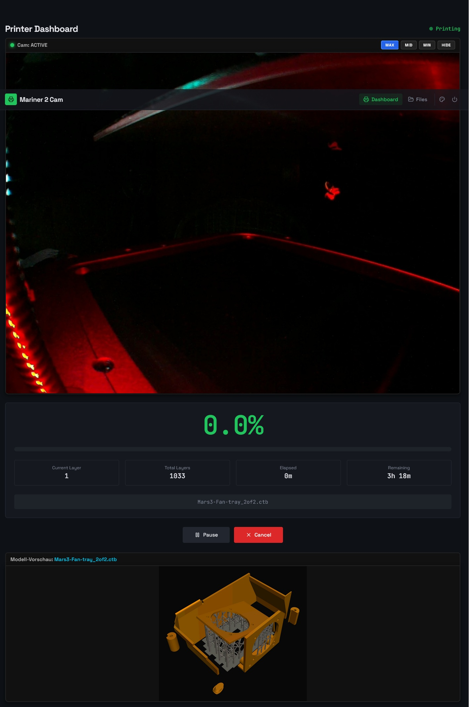

🔴 **This is an advanced version with the timelapse video function. It can make cool videos of your prints.**           12.july,26 - 16:00

It is now workig fine but still work in progress until i tested it more and made final minor changes if needed.

-

-

-

-

-
➡️ **[Click here to see details on the timelapse methods](docs/TIMELAPSE_MEDIAMTX_SETUP.md)**

Notes:
Z.top impulses make jittery videos since detection with two ir-sensors (GPIO27+17) and even 10 markings on the z-spindle is not exact enough, better is when the uv-light in the bottom is detected instead or even better is to use a signal from the mainboard and make a 3,3V signal into gpio22. Frames taken when light is on have much more time to store the picture so less jitter. 
_

The weired (minor) current-layer display bug is still present like in the source version from amd939.
_

The .ctb decrytion of a chitubox file was buggy there too by the way, it crashed. This is fixed now in a quidck and dirty way but now chitubox .ctb file loads fine and preview pictures are showen too but need 1min(!) - this must be a bug i guess. In UVTOOLS created .ctb files work too and are shown much faster (2sek instead of 1min) but are a bit stretched - not too bad - its an UVTOOLS/Mars3 topic btw as i understand, and never a problem.

_____________________________________________________________________________________________________________________________________________________________________________________________________________________________

**from here on it isn't false, but outdated:**
🔴 Mariner 2 Cam for Pi Zero 2

### 3D-Printer Monitoring Tool with Camera Support, WLAN OTG-USB-Gadget, Firewall, VPN, Fail2ban, Webmin and a physical shutdown  ###
**Status:** Work-in-progress, but working stable and fine now. I went through all the steps in my guide again from a fresh install to test it.

You will need a external power adapter for you Pi for sure and be careful that you not run into the double-power problem of your pi+printer.

>**Chitobox-Note:** The ctb decryption from amd989 had to be modified a bit to work on new `.ctb` files (is it a bug or caused by a Chitobox update?).

---

 **GitHub-Project:**
 
  🔴 [https://github.com/frittna/mariner2cam]  * **Last Changes:** 17:53 - 03.June.2026
  
  Is a fork from the great Mariner 2 (amd989)    - [https://github.com/amd989/mariner]
  
  Which was a fork from Mariner (luizribeiro)    - [https://github.com/luizribeiro/mariner]

---

### 📖 Complete Installation Guide & Code

A tested full step-by-step guide to make a fresh Zero 2 W installation can be found here.
You can run it yourself by following this tutorial in 1-2 hours (in German at the moment).

➡️ **[Click here to view: CompleteInstructionZero2.txt](CompleteInstructionZero2.txt)**

---

* **Note for Pi Zero 1.1:** There is a separate instruction for the Zero 1.1 which was *NOT COMPATIBLE* at the beginning with today's automatic scripts. But the Zero 1 is weak and I sold it, so it will not have the same state of progress. If you want to run it on the Zero 1, see the file: `"Anleitung - Mariner2 - PI Zero W 1.1+2 outdated (ARM6).txt"`.

---

### Screenshots

---
